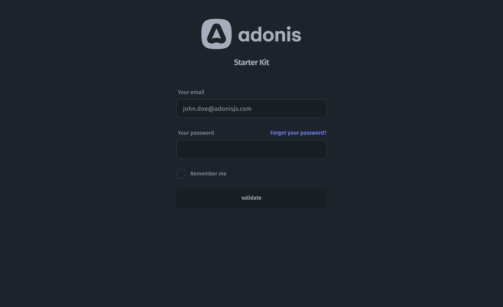
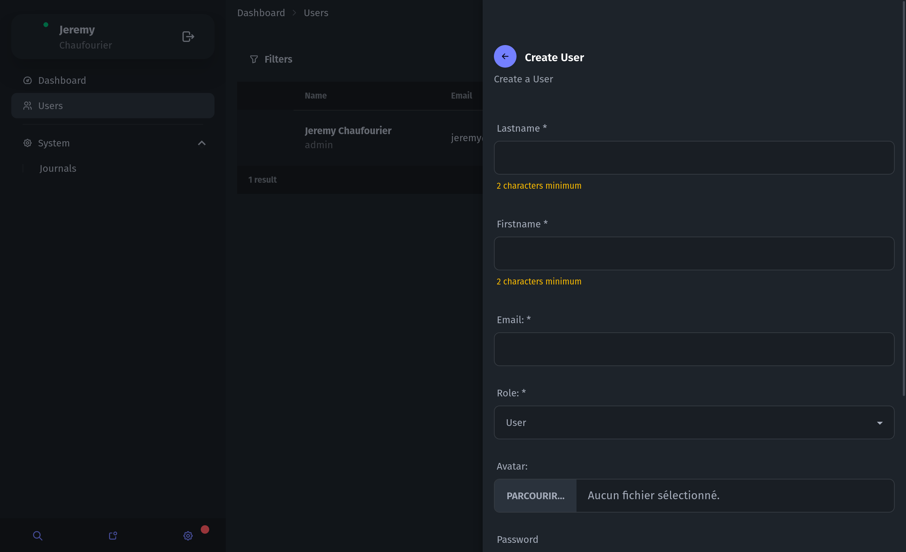

# starter kit for AdonisJS 6

A Node.js, TypeScript & sqlite starter built upon [Adonis JS](https://adonisjs.com) framework.

🔋 Batteries included:

- [x] Sign in form
- [x] Logout
- [x] List / create / delete users in admin page
- [] Avatar upload by attachment-advanced
- [x] Forgot password
- [x] Email create password
- [x] Roles and permissions with AdonisJS bouncers
- [x] i18n
- [x] Last login at
- [x] Form component
- [x] Impersonating users
- [x] [Auditable](https://adonis-auditing.stouder.io)
- [x] [DaysiUI](https://daisyui.com/)
- [x] [Tailwind](https://tailwindcss.com/)
- [x] [Alpinejs](https://alpinejs.dev/)
- [x] [Unpoly](https://unpoly.com/)
- [x] [Vite](https://vitejs.dev/)


# Installation

```bash
npm init adonisjs@latest -- -K="batosai/adonis-starter-kit"
cp .env.example .env
node ace migration:run
node ace db:seed
```

## Developing

```bash
npm run dev
visite http://localhost:3333/admin
```



